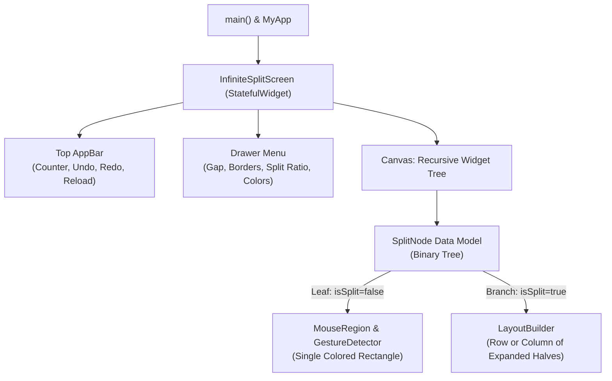

# Flutter Codebase Guide: Infinite Split Rectangles


## 1. Core Flutter Concepts (Quick Primer)

In Flutter, **everything you see on the screen is a Widget**. You build your user interface by composing small widgets together like Lego bricks.

### `StatelessWidget` vs `StatefulWidget`

* **`StatelessWidget`**: A widget that **does not change** after it is built (static UI like an icon, label, or fixed container).
* **`StatefulWidget`**: A widget that **can change over time**. It holds a separate `State` object with variables.
  * Whenever you want to update the screen, you call **`setState(() { ... })`**.
  * Calling `setState()` notifies Flutter to re-run the `build()` method with the new values.

### The Widget Tree
Widgets are arranged in a hierarchy (Parent $\rightarrow$ Children):
```text
MaterialApp (Root)
 └── InfiniteSplitScreen (Scaffold)
      ├── AppBar (Top header with buttons & counter)
      ├── Drawer (Settings panel)
      └── SafeArea (Body canvas)
           └── SplitNode Widgets (Recursive Tree)
```

---

## 2. System Architecture



---

## 3. Code Breakdown (`lib/main.dart`)

### Part 1: Entry Point (`main()`, `themeModeNotifier` & `MyApp`)

```dart
void main() {
  runApp(const MyApp());
}
```
* **`main()`**: The starting point of any Dart program.
* **`runApp()`**: Mounts the widget tree to the device/browser screen.
* **`MyApp`**: Sets the dark theme and loads `InfiniteSplitScreen` as the home screen.

---

### Part 2: The Data Model (`SplitNode`)

Instead of managing rectangles directly in the UI, we represent them as an **immutable Binary Tree**:

```dart
class SplitNode {
  final String id;
  final Color color;
  final bool isSplit;
  final SplitNode? firstChild;
  final SplitNode? secondChild;
  final bool isHorizontal;
  final double splitRatio;
}
```

* **Leaf Node (`isSplit == false`)**: Represents an active, clickable rectangle on the screen.
* **Branch Node (`isSplit == true`)**: A container that holds two children (`firstChild` and `secondChild`), split either horizontally (`Row`) or vertically (`Column`).
* **`count` getter**: Recursively counts all leaf rectangles currently on screen:
  ```dart
  int get count {
    if (!isSplit || firstChild == null || secondChild == null) return 1;
    return firstChild!.count + secondChild!.count;
  }
  ```
* **`recolorWith()`**: Recursively traverses the tree and assigns harmonic shades of a chosen base color to every rectangle.

---

### Part 3: State Management & History (Undo / Redo)

Inside `_InfiniteSplitScreenState`:

```dart
late List<SplitNode> _history;
int _historyIndex = 0;
```

#### How Undo & Redo Works:
1. **Initial State**: `_history` contains `[RootNode]`, and `_historyIndex = 0`.
2. **On Split Click**: 
   - A new `SplitNode` tree is generated.
   - Any forward history is discarded (`_history.sublist(0, _historyIndex + 1)`).
   - The new tree is appended, and `_historyIndex++`.
3. **Undo (`_undo`)**: Simply decrements `_historyIndex--`. The UI instantly reverts to the previous snapshot.
4. **Redo (`_redo`)**: Increments `_historyIndex++` to restore future states.
5. **Reload (`_reload`)**: Resets the canvas back to 1 single initial rectangle.

---

### Part 4: Layout & Rendering (`_buildNodeWidget`)

This method converts a `SplitNode` into real Flutter widgets:

```dart
Widget _buildNodeWidget(SplitNode node) {
  if (!node.isSplit) {
    return MouseRegion(
      cursor: SystemMouseCursors.click,
      child: LayoutBuilder(
        builder: (context, constraints) {
          final isWide = constraints.maxWidth >= constraints.maxHeight;
          return GestureDetector(
            onTap: () => _onRectangleTap(node.id, isWide),
            child: Container(
              margin: EdgeInsets.all(_gap / 2),
              decoration: BoxDecoration(
                color: node.color,
                borderRadius: BorderRadius.circular(_borderRadius),
                border: _borderWidth > 0 
                    ? Border.all(color: _borderColor, width: _borderWidth) 
                    : null,
              ),
            ),
          );
        },
      ),
    );
  }

  final firstFlex = (_splitRatio * 100).round().clamp(10, 90);
  final secondFlex = 100 - firstFlex;

  final children = [
    Expanded(flex: firstFlex, child: _buildNodeWidget(node.firstChild!)),
    Expanded(flex: secondFlex, child: _buildNodeWidget(node.secondChild!)),
  ];

  return node.isHorizontal 
      ? Row(children: children) 
      : Column(children: children);
}
```

#### Key Layout Decisions:
* **`LayoutBuilder`**: Inspects `constraints.maxWidth` and `constraints.maxHeight`. If width $\ge$ height, it splits into left/right (`Row`). Otherwise, top/bottom (`Column`). This prevents rectangles from becoming razor-thin.
* **`Expanded(flex: ...)`**: Distributes space between the two halves according to the live `_splitRatio`.
* **`MouseRegion`**: Displays the standard clickable hand cursor when hovering in Chrome.
* **`GestureDetector`**: Captures tap clicks on specific rectangles by their unique `node.id`.

---

### Part 5: Settings Drawer (`_buildDrawer`)

Opened by clicking the hamburger icon (`☰`) on the top-left:

* **Gap Slider**: Controls spacing between rectangles (`_gap: 0.0 to 20.0 px`).
* **Border Radius Slider**: Controls roundness of rectangle corners (`_borderRadius: 0 to 32 px`).
* **Border Width Slider**: Controls rectangle outlines (`_borderWidth: 0.0 to 8.0 px`).
* **Split Proportion (Resize)**: 
  - Live slider (`_splitRatio: 0.2 to 0.8`) with a dual-color preview bar underneath.
  - Dynamically resizes all split rectangles across the canvas in real time.
* **Pick Color & Palette**:
  - 8 pre-selected color swatches.
  - **"Use Picked Color Family" switch**: Generates harmonious tints of the selected color on each split.
  - **"Apply Picked Color to All" button**: Instant recoloring of the entire canvas.

---

## 4. Class-by-Class Deep Dive

There are **4 classes** in `lib/main.dart`. Here is exactly what each class does and why it exists:

```
┌─────────────────────────────────────────────────────────────┐
│ 1. MyApp (StatelessWidget)                                  │
│    └─ Sets up MaterialApp, Theme, and launches home screen  │
└──────────────────────────────┬──────────────────────────────┘
                               │
┌──────────────────────────────▼──────────────────────────────┐
│ 2. InfiniteSplitScreen (StatefulWidget)                     │
│    └─ Creates the State object                              │
└──────────────────────────────┬──────────────────────────────┘
                               │ creates
┌──────────────────────────────▼──────────────────────────────┐
│ 3. _InfiniteSplitScreenState (State<InfiniteSplitScreen>)   │
│    └─ Manages variables, history, UI build, and events      │
└──────────────────────────────┬──────────────────────────────┘
                               │ renders
┌──────────────────────────────▼──────────────────────────────┐
│ 4. SplitNode (Plain Dart Class - Data Model)                │
│    └─ Stores rectangle tree data (id, color, children)      │
└─────────────────────────────────────────────────────────────┘
```

---

### Class 1: `MyApp`
* **Inheritance**: `extends StatelessWidget`
* **Role**: The application entry configuration.
* **Why `Stateless`?**: The global app settings (title, theme, initial page) do not change dynamically.
* **Key Code**:
  ```dart
  class MyApp extends StatelessWidget {
    const MyApp({super.key});

    @override
    Widget build(BuildContext context) {
      return MaterialApp(
        title: 'Infinite Split Rectangles',
        debugShowCheckedModeBanner: false,
        theme: ThemeData(useMaterial3: true, ...),
        home: const InfiniteSplitScreen(),
      );
    }
  }
  ```

---

### Class 2: `SplitNode`
* **Inheritance**: None (it is a pure Dart data class, NOT a widget).
* **Role**: The **Data Model** for our rectangles.
* **Why a separate class?**: 
  - Keeps data separated from UI.
  - Making it an immutable tree makes **Undo/Redo** effortless (each history step is just a snapshot of `SplitNode`).
* **Fields**:
  | Field | Type | Purpose |
  | :--- | :--- | :--- |
  | `id` | `String` | Unique identifier (e.g. `'0'`, `'0-1'`, `'0-2'`) to find which rectangle was tapped. |
  | `color` | `Color` | The background color of this rectangle. |
  | `isSplit` | `bool` | `false` if it is a single clickable rectangle; `true` if it has split into two. |
  | `firstChild` | `SplitNode?` | Left or top child node when split. |
  | `secondChild` | `SplitNode?` | Right or bottom child node when split. |
  | `isHorizontal` | `bool` | `true` if split into a `Row`, `false` if split into a `Column`. |
  | `splitRatio` | `double` | Flex ratio between the two halves (e.g. `0.5` = 50%/50%). |
* **Key Methods**:
  - `int get count`: Recursive property that traverses all children and counts how many leaf rectangles currently exist.
  - `recolorWith(Color baseColor, Random rng)`: Recursively visits every node and assigns a new harmonious shade of `baseColor`.

---

### Class 3: `InfiniteSplitScreen`
* **Inheritance**: `extends StatefulWidget`
* **Role**: The widget configuration for our main screen.
* **Why `Stateful`?**: Because the screen changes whenever a user clicks to split, slides a slider, or presses undo/redo.
* **Why is it two classes? (`InfiniteSplitScreen` + `_InfiniteSplitScreenState`)**:
  - In Flutter, widgets are rebuilt frequently and are immutable.
  - Flutter separates the **Widget** (lightweight configuration) from the **State** (persistent memory that survives widget rebuilds).
* **Key Code**:
  ```dart
  class InfiniteSplitScreen extends StatefulWidget {
    const InfiniteSplitScreen({super.key});

    @override
    State<InfiniteSplitScreen> createState() => _InfiniteSplitScreenState();
  }
  ```

---

### Class 4: `_InfiniteSplitScreenState`
* **Inheritance**: `extends State<InfiniteSplitScreen>`
* **Role**: The **Controller and View Builder** of the screen.
* **State Variables (Memory)**:
  - `_history`: `List<SplitNode>` storing previous and current canvas states for Undo/Redo.
  - `_historyIndex`: `int` pointing to the currently active snapshot in `_history`.
  - `_gap`, `_borderRadius`, `_borderWidth`, `_borderColor`: Slider values for rectangle aesthetics.
  - `_splitRatio`: Slider value (`0.2` to `0.8`) controlling the flex size of split halves.
  - `_selectedColor`, `_useSingleColorMode`: Color picker states.
* **Core Methods**:
  | Method | What it does |
  | :--- | :--- |
  | `initState()` | Runs once when the screen is created. Sets up the first `SplitNode` in history. |
  | `_onRectangleTap(id, isWide)` | Finds the clicked rectangle, splits it into two children, and pushes a new snapshot into `_history`. |
  | `_splitNode(...)` | Recursive tree algorithm that searches for the target node by `id` and divides it. |
  | `_undo()` | Moves `_historyIndex` backward by 1. |
  | `_redo()` | Moves `_historyIndex` forward by 1. |
  | `_reload()` | Resets the canvas back to 1 rectangle and records it in history. |
  | `_recolorAll()` | Applies shades of the selected color to the entire existing tree. |
  | `build(context)` | Assembles the `Scaffold`, `AppBar`, `Drawer`, and `body`. |
  | `_buildNodeWidget(node)` | Recursively converts each `SplitNode` into Flutter `Container`, `Row`, or `Column` widgets. |
  | `_buildDrawer()` | Constructs the sliding settings menu with sliders and color buttons. |

---

## 5. Key Flutter Widgets Cheatsheet

| Widget | Purpose in this Project |
| :--- | :--- |
| **`Scaffold`** | The main page structure (`appBar`, `drawer`, `body`). |
| **`AppBar`** | Holds the hamburger button, counter chip, undo, redo, and reload buttons. |
| **`Drawer`** | Slide-out drawer holding all customization sliders and color pickers. |
| **`Row` / `Column`** | Horizontal and vertical flex containers for splitting rectangles. |
| **`Expanded`** | Forces children to fill available space according to their `flex` ratio. |
| **`GestureDetector`** | Listens for user touch and click events (`onTap`). |
| **`MouseRegion`** | Changes mouse cursor to `SystemMouseCursors.click` on web. |
| **`Slider`** | Draggable slider for adjusting numerical settings. |
| **`Wrap`** | Arranges color circles in a responsive row that wraps if needed. |

---

## 5. Development & Running Tips

* **Run on Chrome**:
  ```powershell
  cd myapp
  flutter run -d chrome
  ```
* **Hot Reload**: Press **`r`** in your terminal to instantly reflect code changes without restarting.
* **Hot Restart**: Press **`R`** to restart the state from scratch.
* **Run Tests**:
  ```powershell
  flutter test
  ```
